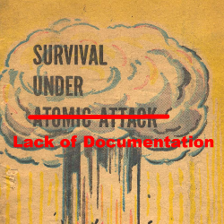

# *Doc and Cover*

*Doc and Cover* is a straightfoward software documentation checker. It provides a one-stop scan of your software files, and provides you with a metric and description of your current developer documentation coverage.

## Use

There are a few ways that we intend for docandcover to be used.   The first is that a user can download the code and run it against any directory that contains code they have written.  This would allow you to check that they have documented all their code. 

Another option is so that you can check someone elses code.  You would give docandcover a github url, and it would clone the remote repo and check it for code coverage.

Additionally it is hoped to integreate this into the software assesment framework. 

## Results

On completion, *Doc and Cover* will output a score of your current in-code documation level.

If you have included a Readme.md with user documentation, it will also output a summary named **externaldocresults** which will list all identified functions and any documentation we have found for these in your readme file.
